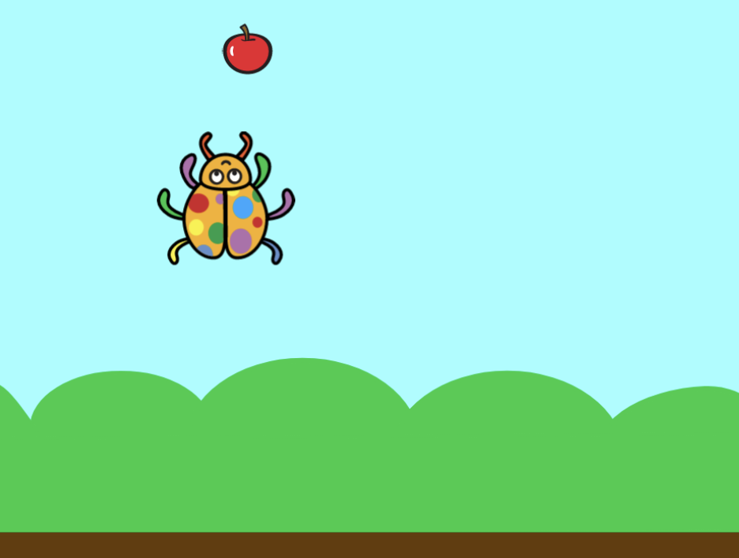

# scratch-games
Games written in [Scratch](https://scratch.mit.edu)

1. Open [Scratch Edior](https://scratch.mit.edu/projects/editor/)
2. **File->Load from your compuler** Select _*.sb3_ file and uplaod
3. Enjoy

## Games

### [Bug and Apple](Bug-and-Apple.sb3)

A Bug collecting apples.

Simple game should be doable by primary school students in 45 minutes

